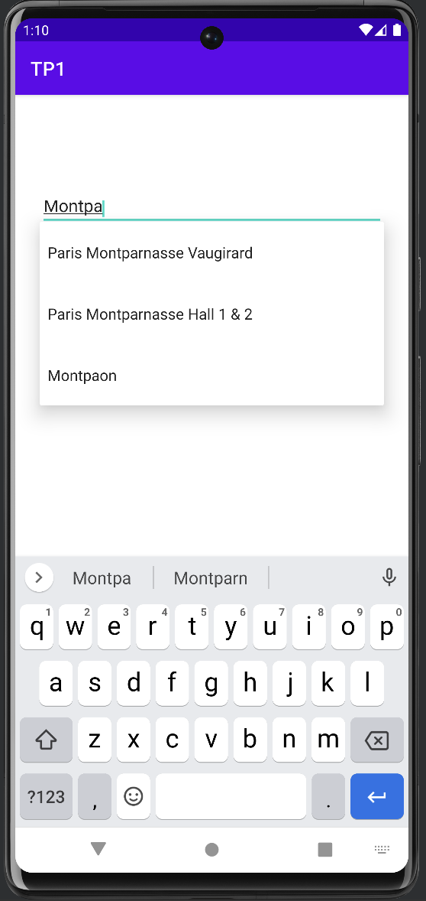
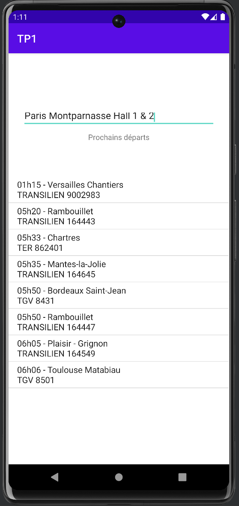
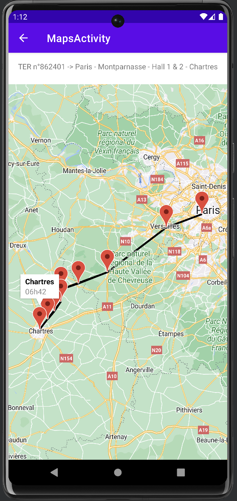

# Application SNCF

This application, made as part of a job during my university course, is an application based on the API of the SNCF company.

This application first retrieves the list of all network stations in a .csv file.
Then the user types in the name of the station they are looking for and then clicks on it, the next 8 departures are displayed with:
- departure time
- destination
- type of train
- train number
  
When you click on a train, a map opens, displaying the train's route with markers representing its various stops. The name of the station and the arrival time of the train are displayed when clicking on a marker.

**Console of the API [here](https://ressources.data.sncf.com/api/v1/console/datasets/1.0/search/ "API SNCF").**
**Documentation of the API [here](https://help.opendatasoft.com/apis/ods-search-v1/#search-api-v1 "API SNCF").**

# Some screenshots

    
    
    

